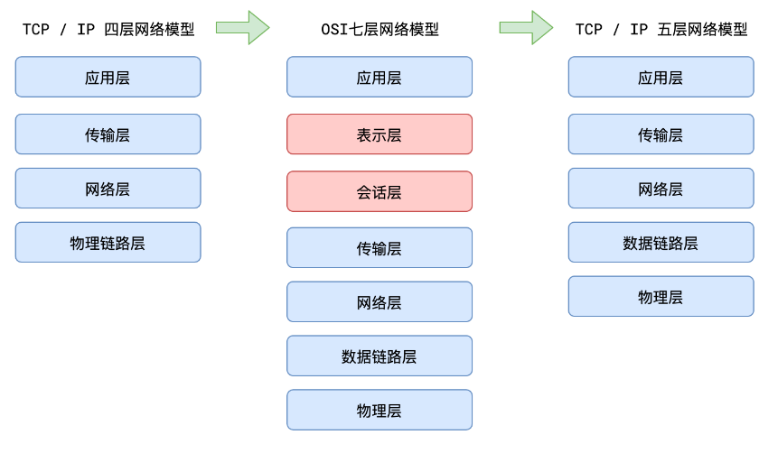
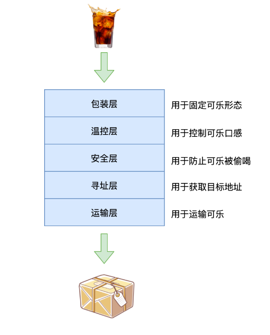
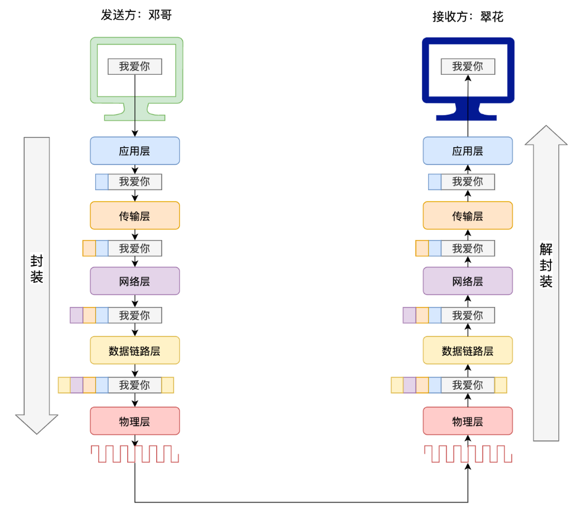

# 网络模型

**OSI 七层模型**：

- **物理层**：负责在物理介质上传输原始的数据比特流，定义了传输介质的规格、电气特性、连接方式等。例如网线、光纤等的相关标准属于这一层。
- **数据链路层**：将原始的传输线路转变成无差错的数据链路，实现相邻节点之间可靠的数据传输。它包括了介质访问控制（MAC）子层和逻辑链路控制（LLC）子层，MAC 地址就是这一层的概念。
- **网络层**：主要任务是选择合适的路由和交换节点，将数据从源主机传输到目标主机。它的关键协议如 IP 协议。
- **传输层**：提供端到端的数据传输服务，确保数据可靠、顺序地到达目的地。常见的协议有 TCP 和 UDP。
- **会话层**：负责建立、维护和管理通信双方之间的会话。比如协调通信双方的交互过程。
- **表示层**：处理数据的表示形式，包括数据格式转换、加密解密、压缩与解压缩等。确保不同系统之间能够正确理解和处理数据。
- **应用层**：为用户提供直接的服务，如电子邮件、文件传输、网页浏览等。常见的应用层协议有 HTTP、FTP 等。

OSI 七层模型具有以下重要意义：

- 它提供了一个清晰的网络体系结构框架，有助于理解网络通信的各个层面和功能。
- 促进了不同厂商设备之间的互操作性和兼容性。
- 方便了网络协议的开发和设计，每个层次可以专注于特定的任务和功能。
- 为网络故障排查和性能优化提供了指导。

然而，在实际应用中，TCP/IP 模型更为广泛使用，但 OSI 七层模型在理论研究和教学等方面仍具有重要地位。
# 分层的意义

当遇到一个复杂问题的时候，可以使用分层的思想把问题简单化

比如，你有半杯82年的可乐，想分享给你的朋友王富贵，但你们已经10年没有联系了。要完成这件事，你可能要考虑：

- 我用什么装可乐？

  可能的方案：塑料瓶、玻璃瓶、煤气罐

- 怎么保证可乐始终处于低温？

  可能的方案：保温杯、小冰箱、冰盒

- 如何保证可乐不被运输的人偷喝？

  可能的方案：封条、在上面写「毒药」

- 如何获取王富贵的地址？

  可能的方案：报案失踪、联系私人侦探、联系物流公司的朋友
  
- 如何运输？

  可能的方案：自行车、汽车、火车、高铁、飞机、火箭

这就形成了一个分层结构

  

从常理出发，我们可以得出以下结论：

- 每层相对独立，只需解决自己的问题
- 每层无须考虑上层的交付，仅需把自己的结果交给下层即可
- 每层有多种方案可供选择，选择不同的方案不会对上下层造成影响
- 每一层会在上一层的基础上增加一些额外信息

# 数据的封装和解封装

