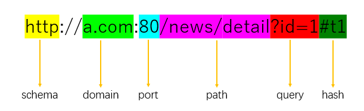
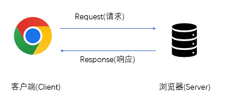
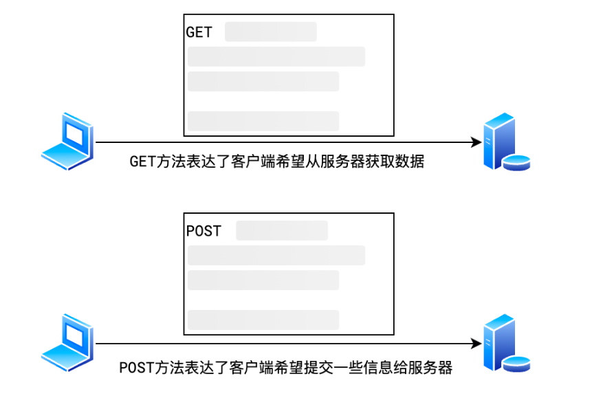
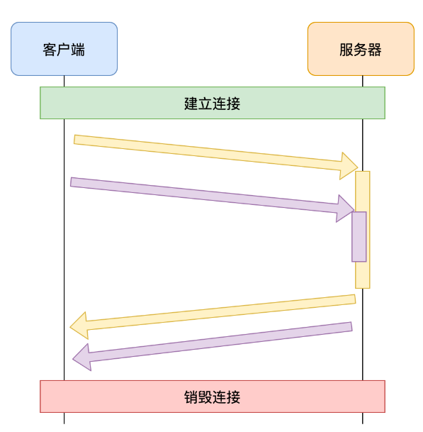
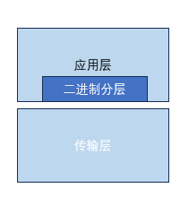
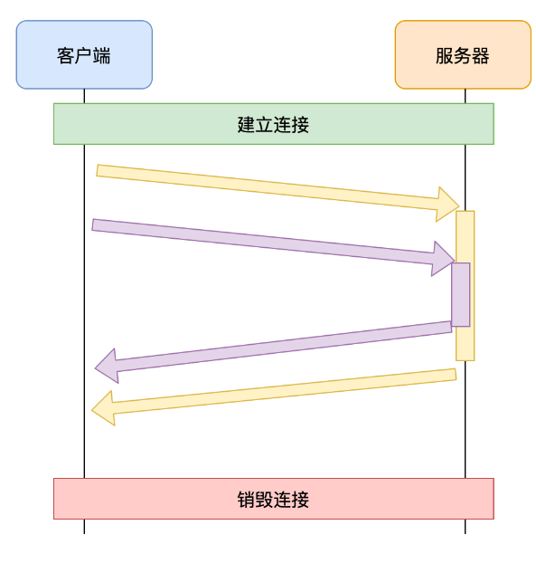
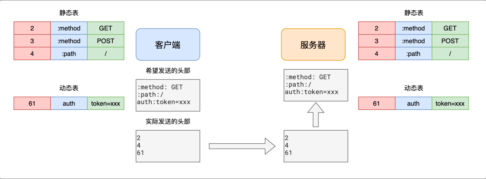

# URL

URL（Uniform Resource Locator）即统一资源定位符，它是一种用于标识互联网上资源的字符串。

URL 通常由以下几个部分组成：

他表达了：

从网络中`哪台计算机(domain)`中的`哪个程序(port)`寻找`哪个服务(path)`,并注明了获取服务的`具体细节(query,hash)`,以及要用什么`协议(schema)`进行通信

- **协议(schema)**：用于指定使用哪种协议来访问该资源，例如 HTTP、HTTPS、FTP 等。
- **域名(domain)**：用于指定要访问的互联网服务器的地址，例如 www.baidu.com。
- **端口号(port)**：用于指定要访问的互联网服务器的端口号，默认为 80。
- **路径(path)**：用于指定要访问的互联网服务器的资源路径，例如 /index.html。
- **查询参数(query)**：用于指定要传递给互联网服务器的参数，例如 ?name=John&age=25。
- **哈希值(hash)**：用于指定页面内的特定位置，例如 #top。

当协议为HTTP时，端口号为80，当协议为HTTPS时，端口号为443。这两个协议的端口号可以省略；
`schema,domain,path` 这三者为必填项，其余为选填项。
URL 通常用于在互联网上定位和访问各种资源，例如网页、文件、服务等。

# 常见的应用层协议

- **HTTP**：用于在互联网上传输网页和数据，是互联网上最常用的应用层协议。
- **HTTPS**：是 HTTP 的安全版本，用于在互联网上传输敏感信息，例如信用卡号、密码等。
- **FTP**：用于在互联网上传输文件，是互联网上最常用的应用层协议之一。
- **SMTP**：用于在互联网上发送电子邮件，是互联网上最常用的应用层协议之一。

# HTTP

HTTP（HyperText Transfer Protocol）即超文本传输协议，是互联网上最常用的应用层协议之一。

HTTP 是一种基于请求-响应模式的、无状态的、应用层的协议。

## 传递消息模式
将发送请求一方称之为客户端(Client)，将接收请求的一方称之为服务器(Server)
  

HTTP 的消息格式是一种纯文本的格式，由以下几个部分组成：

- **起始行(start line)**：用于描述请求或响应的基本信息，例如请求方法、请求 URI、HTTP 版本等。
- **消息头(header)**：用于描述请求或响应的附加信息，例如用户代理、内容类型等。
- **空行**：用于分隔起始行和消息体。
- **消息体(body)**：用于传输请求或响应的数据。

比如以下一段请求报文,以vscode的rest client插件为例
::: code-group

```http:line-numbers [请求报文]
GET /j/search_tags?type=movie&tag=%E7%83%AD%E9%97%A8&source=index HTTP/1.1
Host: movie.douban.com


```
```http:line-numbers [响应报文]
HTTP/1.1 200 OK
Date: Tue, 18 Jun 2024 12:46:44 GMT
Content-Type: application/json; charset=utf-8
Transfer-Encoding: chunked
Connection: close
X-Xss-Protection: 1; mode=block
X-Douban-Mobileapp: 0
Expires: Sun, 1 Jan 2006 01:00:00 GMT
Pragma: no-cache
Cache-Control: must-revalidate, no-cache, private
Set-Cookie: ck="deleted"; max-age=0; domain=.douban.com; expires=Thu, 01-Jan-1970 00:00:00 GMT; path=/,dbcl2="deleted"; max-age=0; domain=.douban.com; expires=Thu, 01-Jan-1970 00:00:00 GMT; path=/
X-DAE-App: movie
X-DAE-Instance: default
Server: dae
Strict-Transport-Security: max-age=15552000
X-Content-Type-Options: nosniff
Content-Encoding: gzip

{
  "tags": [
    "热门",
    "最新",
    "豆瓣高分",
    "冷门佳片",
    "华语",
    "欧美",
    "韩国",
    "日本"
  ]
}

```
:::
请求体是不能省略的，只是因为该插件在发送请求时添加了换行符和请求体

## 请求（Request）
### 请求方法

**请求方法是请求行中的第一个单词，它向服务器描述了客户端发出请求的动作类型。在 HTTP 协议中，不同的请求方法只是包含了不同的语义，但服务器和浏览器的一些约定俗成的行为造成了它们具体的区别**

  

```js
fetch('https://www.baidu.com', {
  method: 'heiheihei', // 告诉百度，我这次请求是来嘿嘿嘿的
});
```
上面的请求中，我们使用了自定义方法`heiheihei`。虽然百度服务器无法理解这样的请求是在干什么，但这样的请求也是可以正常发送到百度服务器的。

在实践中，客户端和服务器慢慢的形成了一个共识，约定俗成的规定了一些常见的请求方法：

- **GET**，表示向服务器获取资源。业务数据在请求行中，无须请求体
- **POST**，表示向服务器提交信息，通常用于产生新的数据，比如注册。业务数据在请求体中
- **PUT**，表示希望修改服务器的数据，通常用于修改。业务数据在请求体中
- **DELETE**，表示希望删除服务器的数据。业务数据在请求行中，无须请求体。
- **OPTIONS**，发生在跨域的预检请求中，表示客户端向服务器申请跨域提交
- **TRACE**，回显服务器收到的请求，主要用于测试和诊断
- **CONNECT**，用于建立连接管道，通常在代理场景中使用，网页中很少用到

::: info GET 和 POST 的区别

**由于浏览器和服务器约定俗称的规则**，造成了 GET 和 POST 请求在 web 中的区别：

1. 浏览器在发送 GET 请求时，不会附带请求体
2. GET 请求的传递信息量有限，适合传递少量数据；POST 请求的传递信息量是没有限制的，适合传输大量数据。
3. GET 请求只能传递 ASCII 数据，遇到非 ASCII 数据需要进行编码；POST 请求没有限制
4. 大部分 GET 请求传递的数据都附带在 path 参数中，能够通过分享地址完整的重现页面，但同时也暴露了数据，若有敏感数据传递，不应该使用 GET 请求，至少不应该放到 path 中
5. 刷新页面时，若当前的页面是通过 POST 请求得到的，则浏览器会提示用户是否重新提交。若是 GET 请求得到的页面则没有提示。
6. GET 请求的地址可以被保存为浏览器书签，POST 不可以
::: 

### 请求头

**请求头是请求行之后的消息头，用于描述请求的附加信息。**

- **Host**：用于指定请求的服务器地址和端口号。
- **Origin**：用于指定请求的源地址,一般只存在于 [CORS 跨域请求](../../browser/cros.md)中，非跨域请求没有该请求头。。
- **User-Agent**：用于指定客户端的浏览器类型和版本。
- **Accept**：告知服务器客户端能够接受的内容类型，以 MIME 类型的形式表达，比如：`text/html`,`application/json`,`text/plain`,`image/*` 等，更多请参考[MIME 类型](https://developer.mozilla.org/zh-CN/docs/Web/HTTP/Basics_of_HTTP/MIME_types)
- **Accept-Encoding**：可接受的编码方式，如 `gzip` 等压缩格式。
- **Authorization**：用于包含认证信息，如基本认证或令牌等。
- **[Cache-Control](https://developer.mozilla.org/zh-CN/docs/Web/HTTP/Headers/Cache-Control)**：控制缓存策略，如 `no-cache` 表示不使用缓存。
- **Content-Length**：表示请求体的长度。
- **Content-Type**：说明请求体的媒体类型，如 `application/json` 表示 JSON 数据。
- **If-Modified-Since**：用于条件请求，如果自指定时间后资源未修改则返回 304 状态码。
- **If-None-Match**：类似 If-Modified-Since，根据资源的 ETag 进行条件请求。
- **Referer**：指示请求是从哪个页面链接过来的。
### 请求体
请求体（Request Body）是在 HTTP 请求中用于承载要发送给服务器的具体数据的部分。

以下是关于请求体的一些要点：

**数据形式**：可以是各种格式的数据，比如表单数据（通常在 `application/x-www-form-urlencoded` 或 `multipart/form-data` 格式中）、JSON 数据（`application/json`）、XML 数据等。

**用途**：用于传递客户端需要提交给服务器的详细信息，比如提交表单时的字段值、发送特定的参数、上传文件等。

**存在情况**：并不是所有请求都有请求体，例如一些简单的 GET 请求通常没有请求体，而 POST、PUT 等请求常常包含请求体来携带重要数据。

**大小限制**：可能会受到服务器配置、网络等因素的限制。

请求体使得客户端能够向服务器发送更丰富、更具体的信息，以实现各种交互操作和数据传递需求。

## 响应（Response）
### 响应行
响应行由[状态码](https://www.runoob.com/http/http-status-codes.html)和状态码的文本描述组成，它们位于响应报文的起始行中。

```txt
HTTP/1.1 200 OK
```

状态码是三位数字，用于表示请求的处理结果。
状态码的文本描述是状态码的英文解释，用于帮助用户理解状态码的含义。
HTTP 定义了以下几种状态码：

| 状态码 | 状态码的文本描述 |
| - | - |
|1xx|信息性状态码|
|2xx|成功状态码|
|3xx|重定向状态码|
|4xx|客户端错误状态码|
|5xx|服务器错误状态码|

### 响应头
响应头是服务器返回给客户端的关于响应的一些元信息。以下是一些常见的响应头及其含义：

**Content-Type**：指示响应体的内容类型，如 `application/json`、`text/html` 等。

**Content-Length**：表示响应体的长度。

**Location**：用于重定向时指定新的资源位置。

**Set-Cookie**：设置客户端的 Cookie。

**Server**：告知客户端服务器的信息。

**Access-Control-Allow-Origin**：在跨域资源共享（CORS）中，指定允许访问该资源的源。

**Cache-Control**：控制缓存策略。

**Expires**：指定资源的过期时间。

**Last-Modified**：表示资源最后一次修改的时间。

**ETag**：资源的唯一标识。

[HTTP表头参考](https://developer.mozilla.org/zh-CN/docs/Web/HTTP/Headers)

## HTTP各版本差异
HTTP 协议的不同版本包括 HTTP/1.0、HTTP/1.1 和 HTTP/2.0，每个版本都有一些特定的特性和改进，以下是它们的主要差异：
### HTTP/1.0
  - **短连接**：每次请求/响应都需要建立一个新的 TCP 连接，完成后立即关闭连接， 连接的建立和销毁都会占用服务器和客户端的资源，造成内存资源和时间的浪费；
  - **队头阻塞**：下一个 HTTP 请求必须在前一个 HTTP 响应到达之前才能发送，如果前一个 HTTP 响应一直不到达，那么下一个 HTTP 请求就不发送；
  - **不支持断点续传**：如果客户端请求的资源特别大，服务器端发送这个资源的时间超出了客户端的超时时间，那么客户端就直接 close 这个 TCP 连接了；
### HTTP/1.1
  - **长连接**：引入了持久连接，减少了连接建立和断开的开销，提高了性能；
  - **管道化技术**：在长连接的基础上，允许单个 TCP 连接可以发送多个请求和接收多个响应，解决了 HTTP/1.0 的队头阻塞问题，但带来了新的队头阻塞问题；如下图：
    - **服务器必须按照客户端请求的先后顺序依次回送相应的结果，以保证客户端能够区分出每次请求的响应内容**。如果最先收到的请求的处理时间长，响应生成也慢，就会阻塞已经生成了的响应的发送。
    
    - 常见解决方案：
      1. 通过减少文件数量，从而减少队头阻塞的几率
      2. 通过开辟多个TCP连接，实现真正的、有缺陷的并行传输。浏览器会根据情况，为打开的页面自动开启TCP连接，对于`同一个域名`的连接最多6个，如果要突破这个限制，就需要把资源放到不同的域中
    现代浏览器一般时默认不开启管道化技术。
  
### HTTP/2.0
  - **二进制分帧层**：HTTP/2中的二进制分帧是该协议的一项重要特性，**它在应用层（HTTP/2）和传输层（TCP 或 UDP）之间增加了一个二进制分帧层**。这是 HTTP/2中最大的改变，也是其性能比 HTTP/1.1有大幅提高的重要原因之一
    
    - 在二进制分帧层中，HTTP/2将所有传输的信息分割为更小的消息和帧，并对它们采用二进制格式的编码。这一特性使得 HTTP/2在处理请求和响应时更加高效。具体而言，HTTP/2中的帧包含以下部分：
      - **类型**：帧的类型，如 DATA、HEADERS、PRIORITY 等。
      - **长度**：帧的长度。
      - **标记**：帧的标记。
      - **流标识**：用于标识帧所属的流。
      - **帧有效载荷**：帧所携带的数据。
  - **多路复用**：它通过将 HTTP 请求和响应分解为帧（Frame），并在一个连接上交错发送这些帧，实现了请求和响应的并行处理，从而提高了性能和效率。；
    
  - **头部压缩**：头部压缩的主要方式是使用 HPACK 算法。HPACK 算法通过在客户端和服务器之间维护一个共享的字典，将常见的头部字段和值进行编码，从而减少头部数据的传输量。具体来说，HPACK 算法使用了以下几种技术：
    - **静态字典**：HPACK 定义了一个静态字典，其中包含了一些常见的头部字段和值。这些字段和值可以通过索引值进行编码，从而减少传输的数据量。
    - **动态字典**：除了静态字典，HPACK 还支持动态字典。客户端和服务器可以在通信过程中动态地添加新的头部字段和值到字典中，以便更高效地编码和解码头部数据。
    - **哈夫曼编码**：对于一些不常见的头部字段和值，HPACK 可以使用哈夫曼编码进行压缩。哈夫曼编码是一种无损压缩算法，可以根据字符出现的频率生成最优的编码表，从而进一步减少数据量。
    
  - **服务器推送**：允许服务器主动向客户端推送资源，当客户端请求某个资源时，服务器可以预测客户端需要的其他资源并主动推送给客户端，提高了页面加载速度；
  - **流量控制和优先级**：支持流量控制和优先级控制，可以根据资源的重要性和紧急程度进行有效的调度和分配，提高了网络的利用率和性能；

### HTTP/3.0
 HTTP/2.0 并没有完全解决队头阻塞问题，只能说解决了应用层的队头阻塞问题，由于是基于TCP协议的，因此当网络不好时，存在丢包的场景，TCP 会进行快速重传，导致堵塞。
 ​底层协议革新：

HTTP/3 采用 `​QUIC 协议`​（基于 UDP），每个流（Stream）都是独立传输的，即使某个流的数据包丢失，其他流仍可正常传输，彻底解决了传输层的队头阻塞。
​关键优势：

- 独立流处理：QUIC 将数据流与传输通道解耦，丢包仅影响当前流，其余流可继续并行加载。
​
- 0-RTT 快速连接：首次连接无需等待 TCP 三次握手，直接发送数据，进一步降低延迟。
