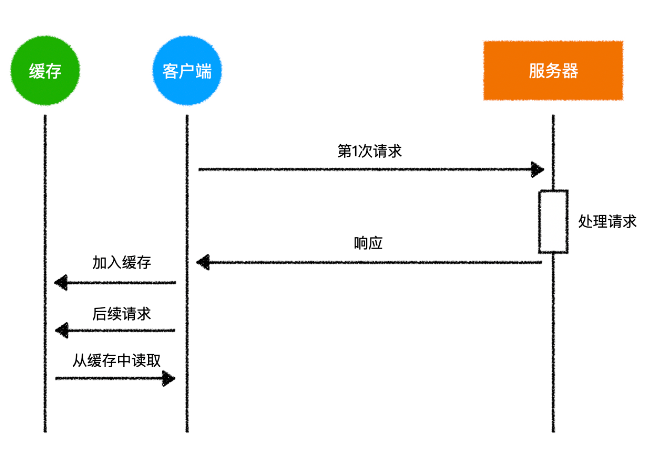
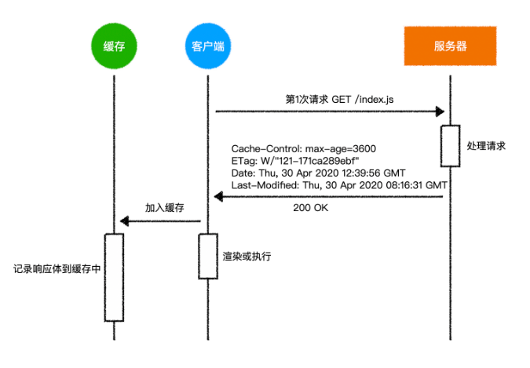
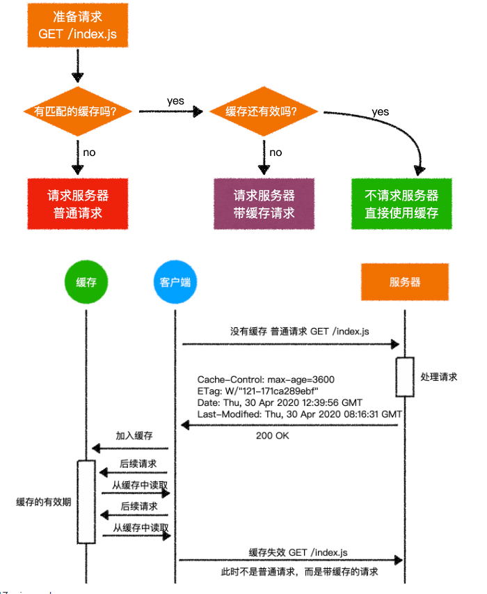
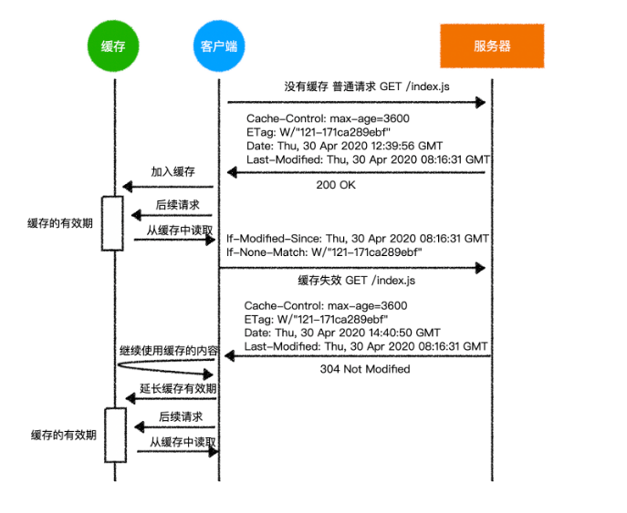

# HTTP缓存分类
HTTP 缓存是一种用于提高 Web 性能和减少网络带宽使用的机制。

**缓存的类型**：
|缓存类型|存储位置和作用范围|缓存内容|控制方式|更新机制|隐私性|
|---|---|---|---|---|---|
|**代理服务器缓存**|位于网络中的代理服务器上，可以服务于多个用户和设备，作用范围更广。|可能会缓存更广泛的公共资源，尤其是经常被多个用户请求的常见资源。|通常由代理服务器的管理员进行配置和管理。|更新策略相对更复杂，可能基于时间、资源变化或者服务器的特定指令。|由于服务多个用户，可能涉及到更多的隐私和安全考虑。|
|**浏览器缓存**|存储在用户使用的本地浏览器中，只对该用户的特定设备和浏览器有效。|通常会缓存用户访问过的页面、图片、脚本等各种资源。|主要由浏览器根据服务器返回的缓存控制头信息和用户的设置来控制。|当浏览器检测到缓存的资源过期或者服务器指示更新时，会重新获取最新资源。|与单个用户的浏览行为和设备相关，相对更私密。|


**缓存控制机制**：
- `Cache-Control` 头部：用于更精细地控制缓存策略，
  1. `public`：表示响应可以被任何缓存（包括浏览器缓存、代理服务器缓存等）存储。
  2. `private`：表示响应只能被单个用户的浏览器缓存，不能被代理服务器缓存。
  3. `no-cache`：表示在使用缓存前必须先与服务器确认资源是否更新。
  4. `no-store`：表示禁止任何形式的缓存，每次请求都要从服务器获取最新的资源。
  5. `max-age=[seconds]`：指定资源的有效时间，单位为秒。例如，`max-age=3600` 表示资源在 3600 秒内有效。
  6. `s-maxage=[seconds]`：类似于 `max-age`，但仅适用于共享缓存（如代理服务器）。
  7. `must-revalidate`：表示缓存过期后必须向服务器重新验证资源的有效性。
  这些值可以组合使用，以更精确地控制缓存策略。 
- `Expires` 头部：指定一个绝对的过期时间。

**缓存验证**：
- `Last-Modified` 和 `If-Modified-Since`：服务器发送资源时提供 `Last-Modified` 头部，表示资源的最后修改时间，客户端后续请求时使用 `If-Modified-Since` 携带该时间，服务器据此判断资源是否更新。
- `ETag` 和 `If-None-Match`：服务器为资源生成唯一的 `ETag`，客户端请求时使用 `If-None-Match` 携带，服务器对比判断。

**缓存的优点**：
- 减少服务器负载：降低服务器处理重复请求的压力。
- 加快页面加载速度：直接从本地获取缓存数据，无需再次请求服务器。
- 节省网络带宽：减少数据传输量。

然而，缓存也可能带来一些问题，例如缓存过期导致获取到旧数据，或者缓存配置不当导致用户无法获取最新内容。因此，需要合理设置缓存策略以平衡性能和数据的新鲜度。 

# 浏览器缓存
## 缓存的基本原理

客户端缓存的原理如下：



> 这只是一个简易的原理图，实际情况可能有差异

这里就设计到一个缓存策略的问题，这些问题包括：

- 哪些资源需要加入到缓存，哪些不需要？
- 缓存的时间是多久呢？
- 如果服务器的资源有改动，客户端如何更新缓存呢？
- 如果缓存过期了，可是服务器上的资源并没有发生变动，又该如何处理呢？
- .......

要回答这些问题，就必须要清楚`http`中关于缓存的协议

理解了http的缓存协议，自然就能回答上面的问题了。

## 来自服务器的缓存指令

当客户端发出一个`get`请求到服务器，服务器可能有以下的内心活动：「你请求的这个资源，我很少会改动它，干脆你把它缓存起来吧，以后就不要来烦我了」

为了表达这个美好的愿望，服务器在**响应头**中加入了以下内容：

```
Cache-Control: max-age=3600
ETag: W/"121-171ca289ebf"
Date: Thu, 30 Apr 2020 12:39:56 GMT
Last-Modified: Thu, 30 Apr 2020 08:16:31 GMT
```
::: details 浏览器只会缓存GET请求么？
浏览器并非只会缓存 GET 请求。
POST、PUT 等其他请求方法的响应在满足一定条件时也可能被缓存。然而，由于 POST 等方法通常用于修改服务器上的数据，其可缓存性的场景相对较少。
缓存的关键因素通常不是请求方法本身，而是服务器返回的响应头中的缓存控制信息，例如 Cache-Control 和 Expires 等。如果服务器在响应头中明确指示可以缓存，并且设置了适当的缓存策略，无论请求方法是 GET 还是其他，浏览器都可能按照策略进行缓存。
但在实际应用中，GET 请求由于通常用于获取数据且不修改服务器状态，其响应被缓存的情况更为常见。
:::
这个响应头表达了下面的信息：

- `Cache-Control: max-age=3600`，我希望你把这个资源缓存起来，缓存时间是3600秒（1小时）
- `ETag: W/"121-171ca289ebf"`，这个资源的编号是`W/"121-171ca289ebf"`
- `Date: Thu, 30 Apr 2020 12:39:56 GMT`，我给你响应这个资源的服务器时间是格林威治时间`2020-04-30 12:39:56`
- `Last-Modified: Thu, 30 Apr 2020 08:16:31 GMT`，这个资源的上一次修改时间是格林威治时间`2020-04-30 08:16:31`

这个美好的缓存愿望，就这样通过响应头传递给客户端了

如果客户端是其他应用程序，可能并不会理会服务器的愿望，也就是说，可能根本不会缓存任何东西。

但是凑巧客户端是一个浏览器，它和服务器一直以来都是相亲相爱的小伙伴，当它看到服务器的这个响应头表达的美好愿望后，立即忙起来：

- 浏览器把这次请求得到的响应体缓存到本地文件中
- 浏览器标记这次请求的请求方法和请求路径
- 浏览器标记这次缓存的时间是3600秒
- 浏览器记录服务器的响应时间是格林威治时间`2020-04-30 12:39:56`
- 浏览器记录服务器给予的资源编号`W/"121-171ca289ebf"`
- 浏览器记录资源的上一次修改时间是格林威治时间`2020-04-30 08:16:31`

这一次的记录非常重要，它为以后浏览器要不要去请求服务器提供了各种依据。



## 来自客户端的缓存指令

当客户端收拾好行李，准备再次请求`GET /index.js`时，它突然想起了一件事：我需要的东西在不在缓存里呢？

此时，客户端会到缓存中去寻找是否有缓存的资源

寻找的过程如下：

1. 缓存中是否有匹配的请求方法和路径？
2. 如果有，该缓存资源是否还有效呢？

以上两个验证会导致浏览器产生不同的行为

要验证是否有匹配的缓存非常简单，只需要验证当前的请求方法`GET`和当前的请求路径`/index.js`是否有对应的缓存存在即可

如果没有，就直接请求服务器，就和第一次请求服务器时一样，这种情况没有什么好讨论的

关键在于验证缓存是否有效

如何验证呢？

非常简单，就是把`max-age + Date`，得到一个过期时间，看看这个过期时间是否大于当前时间，如果是，则表示缓存还没有过期，仍然有效，如果不是，则表示缓存失效。

## 缓存有效

当浏览器发现缓存有效时，完全不会请求服务器，直接使用缓存即可得到结果

此时，如果你断开网络，会发现资源仍然可用

这种情况会极大的降低服务器压力，但当服务器更改了资源后，浏览器是不知道的，只要缓存有效，它就会直接使用缓存

## 缓存无效

当浏览器发现缓存已经过期，它**并不会简单的把缓存删除**，而是抱着一丝希望，想问问服务器，我**这个缓存还能继续使用吗**？

于是，浏览器向服务器发出了一个**带缓存的请求**，又称之为**协商缓存**

所谓带缓存的请求，无非就是加入了以下的请求头：

```
If-Modified-Since: Thu, 30 Apr 2020 08:16:31 GMT
If-None-Match: W/"121-171ca289ebf"
```

它们表达了下面的信息：

- `If-Modified-Since: Thu, 30 Apr 2020 08:16:31 GMT`，亲，你曾经告诉我，这个资源的上一次修改时间是格林威治时间`2020-04-30 08:16:31`，请问这个资源在这个时间之后有发生变动吗？
- `If-None-Match: W/"121-171ca289ebf"`，亲，你曾经告诉我，这个资源的编号是`W/"121-171ca289ebf`，请问这个资源的编号发生变动了吗？

其实，这两个问题可以合并为一个问题：快说！资源到底变了没有！

之所以要发两个信息，是为了兼容不同的服务器，因为有些服务器只认`If-Modified-Since`，有些服务器只认`If-None-Match`，有些服务器两个都认

> 目前的很多服务器，只要发现`If-None-Match`存在，就不会去看``If-Modified-Since`
>
> `If-Modified-Since`是`http1.0`版本的规范，`If-None-Match`是`http1.1`的规范

此时，问题又抛给了服务器，接下来，就是服务器的表演时间了

服务器可能会产生两个情况：

- 缓存已经失效
- 缓存仍然有效

如果是第一种情况——**缓存已经失效**，那么非常简单，服务器再次给予一个正常的响应（响应码`200` 带响应体），同时可以附带上新的缓存指令，这就回到了上一节——来自服务器的缓存指令

这样一来，客户端就会重新缓存新的内容

但如果服务器觉得**缓存仍然有效**，它可以通过一种极其简单的方式告诉客户端：

- 响应码为`304 Not Modified`
- 无响应体
- 响应头带上新的缓存指令，见上一节——来自服务器的缓存指令

这样一来，就相当于告诉客户端：「你的缓存资源仍然可用，我给你一个新的缓存时间，你那边更新一下就可以了」

于是，客户端就继续happy的使用缓存了

这样一来，可以最大程度的减少网络传输，因为如果资源还有效，服务器就不会传输消息体

它们完整的交互过程如下：

## 强缓存与协商缓存
强缓存和协商缓存是浏览器缓存的两种类型，它们的主要区别在于`是否需要与服务器进行通信来验证缓存的有效性`。

**强缓存是指浏览器在本地缓存中直接读取资源，而不会向服务器发送请求**。当浏览器第一次请求资源时，服务器会返回资源的内容以及一些缓存控制头信息，如`Cache-Control`和`Expires`。浏览器会根据这些头信息来决定是否将资源缓存以及缓存的有效期。如果在有效期内再次请求该资源，浏览器会直接从本地缓存中读取，而不会发送请求到服务器，此时的状态码为`200 OK`。也就是上文提到的[缓存有效](#缓存有效)

**协商缓存则需要浏览器向服务器发送请求，以验证缓存的有效性**。当浏览器第一次请求资源时，服务器除了返回资源内容外，还会返回一个唯一的标识，如`Etag`或`Last-Modified`。浏览器会将这个标识存储在本地缓存中。当再次请求该资源时，浏览器会在请求头中携带这个标识，并发送给服务器。服务器会根据标识来判断资源是否有更新。如果资源没有更新，服务器会返回一个`304 Not Modified`的状态码，告诉浏览器可以使用本地缓存中的资源；如果资源有更新，服务器会返回新的资源内容以及新的标识。也就是上文提到的[缓存无效](#缓存无效)
