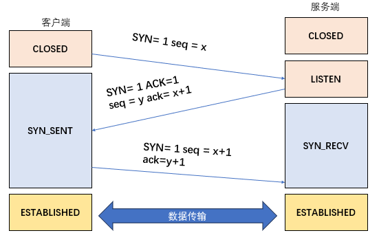
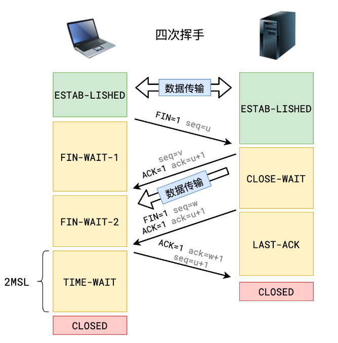

## 概念
TCP（Transmission Control Protocol，传输控制协议）是一种面向`连接的、可靠的、基于字节流`的传输层通信协议。

**特点**：
1. 面向连接：在数据传输之前，需要通过“三次握手”建立连接，传输结束后通过“四次挥手”释放连接。
2. 可靠传输：通过序列号、确认应答、超时重传、滑动窗口等机制保证数据的可靠交付，确保数据按顺序、无差错地到达目的地。
3. 拥塞控制：TCP 具有拥塞控制机制，例如慢启动、拥塞避免、快速重传和快速恢复，以避免网络拥塞和提高网络的利用率。
4. 流量控制：通过接收方通告的窗口大小来控制发送方的数据发送速率，防止接收方缓冲区溢出。

::: details TCP 连接的建立和断开过程涉及以下标志位和状态：
- **标志位**：
    - **SYN**：同步标志位，用于建立连接时的同步请求。
    - **ACK**：确认标志位，用于确认接收到的数据。
    - **FIN**：结束标志位，用于释放连接。
    - **RST**：重置标志位，用于异常情况下重置连接。
- **状态**：
    - **CLOSED**：初始状态，表示连接尚未建立或已关闭。
    - **LISTEN**：服务器端处于监听状态，等待客户端的连接请求。
    - **SYN-SENT**：客户端已发送 SYN 包，等待服务器的确认。
    - **SYN-RECV**：服务器已收到 SYN 包，正在等待客户端的确认。
    - **ESTABLISHED**：连接已建立，双方可以进行数据传输。
    - **FIN-WAIT-1**：主动关闭方已发送 FIN 包，等待对方的确认。
    - **FIN-WAIT-2**：主动关闭方已收到对方的确认，等待对方发送 FIN 包。
    - **CLOSE-WAIT**：被动关闭方已收到对方的 FIN 包，等待本地应用程序关闭连接。
    - **LAST-ACK**：被动关闭方已发送 FIN 包，等待对方的确认。
    - **TIME-WAIT**：主动关闭方收到对方的确认后，进入 TIME-WAIT 状态，等待一段时间后关闭连接。
    - **CLOSING**：双方同时发送 FIN 包，等待对方的确认。

在 TCP 连接的建立过程中，客户端和服务器端通过交换 SYN、ACK 等标志位的数据包来协商连接参数，并建立可靠的连接。在连接释放过程中，双方通过发送 FIN 包来通知对方关闭连接，并进行相应的确认和清理操作。

这些标志位和状态的交互确保了 TCP 连接的可靠性和稳定性，使得数据能够准确无误地传输。
:::

## 建立连接（三次握手）
- 一开始，客户端和服务端都处于 `CLOSED` 状态。
- 服务端监听某个端口，进入 `LISTEN` 状态。
- 客户端发送连接请求报文，标志位 `SYN` 置为1，随机初始化序列号为 `x`，并把该数据包发送给服务端，客户端进入 `SYN_SENT` 状态。
- 服务端收到 `SYN` 报文后，发送 `SYN-ACK` 报文，标志位 `SYN` 和 `ACK` 都置为1，确认序列号设置为 `x + 1`,序列号设置为`y`，并把该数据包发送给客户端以确认连接请求，服务端进入 `SYN_RECV` 状态。
- 客户端收到 `SYN-ACK` 报文后，发送 `ACK` 报文，标志位 `ACK` 置为1，序列号设置为 `x + 1`，确认序列号设置为 `y + 1`，客户端进入 `ESTABLISHED` 状态。
- 服务端收到 `ACK` 报文后，进入 `ESTABLISHED` 状态。
- 至此，TCP 连接建立完成，客户端和服务端可以相互发送数据。

## 断开连接（四次挥手）

- 客户端或服务端任一方执行 `close` 来触发连接断开，双方都可以主动请求断开连接。
- 如果客户端打算断开连接，那么客户端会发送一个 `FIN` 标志位为1的报文，即 `FIN` 报文，客户端进入 `FIN_WAIT_1` 状态。
- 服务端收到 `FIN` 报文后，发送 `ACK` 应答报文，标志位 `ACK` 置为1，确认序列号设置为 `u + 1`，服务端进入 `CLOSE_WAIT` 状态，客户端收到 `ACK` 应答报文后，进入 `FIN_WAIT_2` 状态。
- 等待服务端处理完数据，服务端被动请求断开连接，服务端发送 `FIN` 报文，标志位 `FIN` 和 `ACK` 都置为1，确认序列号设置为 `u + 1`，服务端进入 `LAST_ACK` 状态。
- 客户端收到 `FIN` 报文后，客户端会发送 `ACK` 应答报文，标志位 `ACK` 置为1，序列号设置为 `u + 1`，确认序列号设置为 `w + 1`，客户端进入 `TIME_WAIT` 状态，当服务端收到 `ACK` 报文后，服务端进入 `CLOSED` 状态，至此服务端完成连接的关闭。
- 客户端在经过 `2MSL` 时间后，自动进入 `CLOSED` 状态，至此客户端也完成了连接的关闭。

在建立连接的过程中，通过三次握手可以确保客户端和服务端都具备发送和接收数据的能力，并且可以协商初始序列号等参数。在断开连接的过程中，通过四次挥手可以确保双方都能正确地结束通信，释放相关资源。

## 缺点
1. ​连接建立与释放开销大：三次握手和四次挥手增加了延迟，尤其在高并发场景下影响性能。
​
2. 传输效率较低：确认应答和重传机制导致额外开销，尤其在丢包率高的网络中，性能下降明显。
​
3. 头部信息冗余：TCP头部包含较多控制字段（如序列号、确认号、窗口大小），占用额外带宽。

4. ​队头阻塞问题（应用层）​：
虽基于TCP的HTTP/2通过多路复用缓解了部分问题，但底层TCP的有序传输特性仍可能导致整个连接的阻塞​（如单个数据包丢失导致后续数据等待）