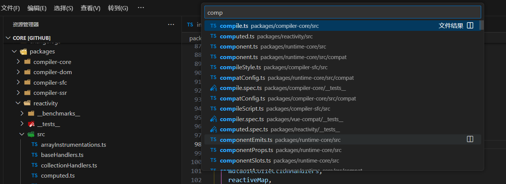
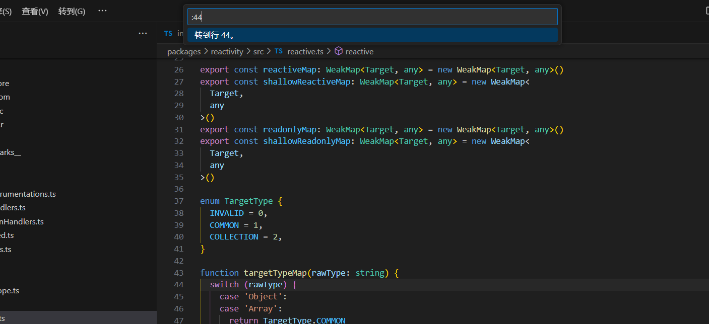
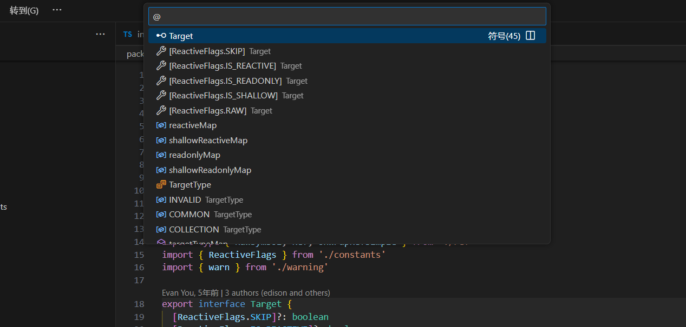
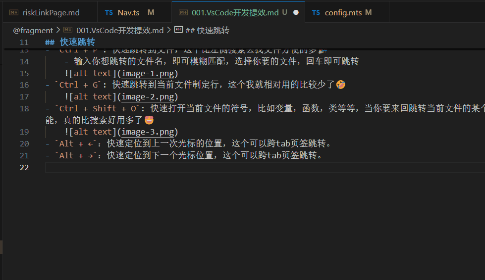
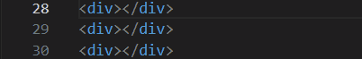

作为程序员，一个熟悉的编辑器总是能提高你的开发效率的。✌️

接下来分享一下我使用vscode一些常用的操作

## 代码行操作
- `Alt + ↑`: 上移一行，在当前行使用该快捷键，会将当前行和上一行进行交换
- `Alt + ↓`: 下移一行，在当前行使用该快捷键，会将当前行和下一行进行交换
- `Shift + Alt + ↑`: 复制当前行，并插入在当前行上面
- `Shift + Alt + ↓`: 复制当前行，并插入在当前行下面
- `Ctrl + Shift + K`: 删除选中行

## 快速跳转

- `Ctrl + P`: 快速跳转到文件，这个比左侧搜索去找文件方便的多🎉
    - 输入你想跳转的文件名，即可模糊匹配，选择你要的文件，回车即可跳转
    
    
- `Ctrl + G`: 快速跳转到当前文件制定行，这个我就相对用的比较少了🤣

    
- `Ctrl + Shift + O`: 快速打开当前文件的符号，比如变量，函数，类等等，当你要来回跳转当前文件的某个变量的时候，就可以使用这个功能，真的比搜索好用多了😍
- `Ctrl + T`: 打开全局的符号，比如我想查看其他文件的类型定义方法，就可以使用这个功能。

    
- `Alt + ←`：快速定位到上一次光标的位置，这个可以跨tab页签跳转。
- `Alt + →`：快速定位到下一个光标位置，这个可以跨tab页签跳转。
    - 比如我当前光标在 21 行，然后我跳转到第 1 行，然后我按下 `Alt + ←`，那么就会跳转到第 21 行。按下 `Alt + →`，就会跳转到第 1 行。

    

## 多光标与选区
- `Alt + 鼠标左键 或 Crtl + Alt + ↑/↓`：可以快速创建多个光标。比如我想同时操作多个行，那么就可以用这个快捷键。比如给多个元素添加相同的类名
    
- `Ctrl + U`：撤销光标操作
- `Ctrl + L`：快速选中当前行中的所有字符
- `Ctrl + Shift + ↓`: 扩展选区
- `Ctrl + Shift + ↑`：减少选区

## 分组
- `Ctrl + \`: 代码分割
- `Ctrl + 1 / 2 / 3`: 创建或切换分组
- `Ctrl + 1 / 2 / 3`: 切换当前分组的tab
- `Alt + 1 / 2 / 3`: 组内切换tab

## 引用与其他
- `F12`: 查看当前选中符号的引用，比如方法，变量等
- `Ctrl + D`: 对选中的文本进行匹配，按下该快捷键，会将该文件中下一个出现该文本的地方选中，可以做批量操作
- `F2`: 在当前文件中，选中的符号出现的地方进行重命名

## 参考链接
- [VSCode 快捷键](https://code.visualstudio.com/shortcuts/keyboard-shortcuts-windows.pdf)