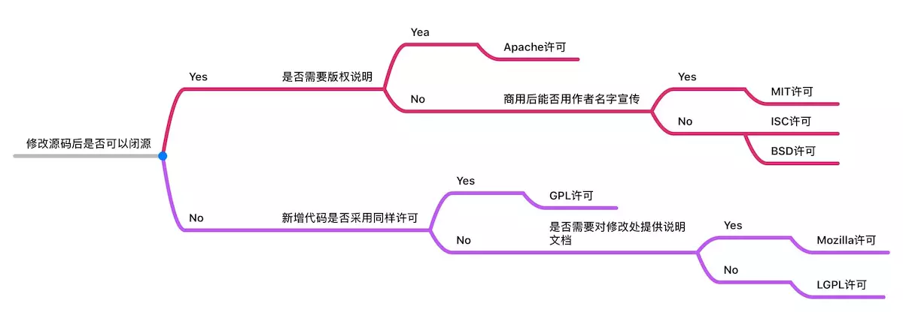

## 包是什么?
包是一个包含多个模块的文件夹。从上文说到,模块就是一个文件,里面包含一个或多个函数。包可以包含多个模块,并且可以包含子包。
## 包管理器的作用
- **简化依赖管理：** 在一个复杂的项目中，可能会依赖众多的外部模块。包管理器可以清晰地列出和管理这些依赖关系，确保项目在不同环境下都能正确运行，避免因缺少某些依赖而导致错误。
- **方便安装和更新：** 它使得获取和升级包变得非常便捷。不需要手动去查找、下载、解压和配置每个包，只需简单的命令即可完成安装和更新操作。
版本控制：可以指定包的特定版本，这有助于维持项目的稳定性。不同版本的包可能有不同的功能和行为，通过包管理器能更好地控制版本，避免因包版本不兼容带来问题。
- **提高效率:** 节省了开发者寻找、整合资源的时间和精力，让他们能够专注于核心业务逻辑的开发。
- **促进代码复用:** 大量的优质包可供选择，加速了开发进程，避免重复造轮子。
- **生态系统建设:** 包管理器有助于构建一个活跃的社区和生态系统，鼓励开发者共享和贡献代码，促进整个技术领域的发展。
## 语义化版本 2024/5/29
语义化版本是一种软件版本的命名规范。

它的格式通常为“主版本号.次版本号.修订版本号”。

**主版本号**：当进行不兼容的 API 更改时递增。

**次版本号**：当添加了向后兼容的新功能时递增。

**修订版本号**：当进行了向后兼容的错误修复时递增。

语义化版本的好处包括：
- 清晰地传达版本之间的变化程度。
- 帮助开发者和用户更好地理解不同版本的差异和兼容性。
- 便于管理依赖关系和进行软件升级决策。

例如，一个项目从版本 1.0.0 升级到 1.1.0，表示添加了一些新功能但保持了兼容性；而升级到 2.0.0 则可能意味着有较大的不兼容更改。

在实际开发中，遵循语义化版本规范可以提高软件的可维护性和可管理性。
## 常见的包管理工具 
- npm(官方管理工具),Node.js官方的包管理工具，是最早的包管理器之一，拥有大量活跃的社区和丰富的包库
- yarn
- pnpm

## npm 
### npm 常见命令
以下是一些常见的 NPM 命令及其解释：

- `npm init`：用于初始化一个新的 Node.js 项目，创建 `package.json` 文件。
- `npm install`：安装项目依赖的包。可以直接使用，也可以指定具体的包名，如 `npm install <packageName>` 。
- `npm install --save`：安装包并将其添加到 `package.json` 的 `dependencies` 中。
- `npm install --save-dev`：安装包并添加到 `package.json` 的 `devDependencies` 中，通常是开发过程中用到的工具包。
- `npm uninstall <packageName>`：卸载指定的包。
- `npm update`：更新所有已安装的包到最新版本。
- `npm outdated`：检查哪些包有更新的版本可用。
- `npm list`：列出已安装的包及其依赖关系。
- `npm run <scriptName>`：执行在 `package.json` 中定义的脚本。
- `npm version <major|minor|patch>`：更新项目版本。
- `npm cache clean`：清理 NPM 缓存。
- `npm publish`：发布一个包到 NPM 仓库。   
- `npm unpublish <packageName>@<version>`：从 NPM 仓库中撤回一个已发布的包。
- `npm login`：登录到 NPM 账号。
- `npm logout`：登出 NPM 账号。
- `npm whoami`：查看当前登录的用户。
- `npm search <packageName>`：搜索 NPM 仓库中的包。
- `npm info <packageName>`：查看包的详细信息。
- `npm docs <packageName>`：查看包的文档。
- `npm config set <key> <value>`：设置 NPM 的配置项。
- `npm config get <key>`：获取 NPM 的配置项。
- `npm config list`：列出 NPM 的配置项。
- `npm config delete <key>`：删除 NPM 的配置项。
- `npm config edit`：打开 NPM 的配置文件进行编辑。
- `npm config set registry <url>`：设置 NPM 的镜像源。
### npm install 过程
以下是 `npm install` 大致的过程：

1. **读取 `package.json`**：获取项目所需要的直接依赖和版本范围要求。
2. **检查本地缓存**：查看 `node_modules` 中是否已存在满足要求的依赖版本，如果有则可能跳过下载。
3. **从仓库获取依赖信息**：与 npm 仓库进行通信，获取依赖的详细版本信息。
4. **解决版本冲突**：如果存在多个依赖对同一模块有不同要求，通过一定策略确定最终使用的版本。
5. **下载依赖包**：将确定的依赖包及其相关资源下载到本地。
6. **构建依赖树**：按照依赖关系构建层次结构。
7. **安装到 `node_modules`** ：将依赖包正确放置到 `node_modules` 中。
8. **执行安装后脚本** ：如果依赖包有定义安装后脚本，依次执行这些脚本。
9. **生成或更新 `package-lock.json`** ：记录精确的依赖版本和安装信息。

### 开源协议
可以通过网站 http://choosealicense.online/appendix/ 选择协议，并复制协议内容

### 如何发包
要发布一个包到 NPM 上，可以按照以下步骤进行：
1. 确保npm镜像为官网镜像。
2. 确保你已经有一个 NPM 账号，如果没有则去 NPM 官网注册。
3. 在要发布的包的目录下，有一个准确的 `package.json` 文件，包含包的必要信息，如名称、版本、描述等。
4. 创建README.md 文件，输入包描述；
5. 创建LICENSE文件，输入开源协议内容；
6. 创建CHANGELOG.md 文件，记录包的更新日志；
7. 登录到 NPM：`npm login`，输入你的账号，会让你在网页上登录。
8. 执行发布命令：`npm publish`。
9. 发布成功后，可以在 NPM 官网的包列表中看到你的包。

举例说明：
1. 初始化文件夹，第一步

    ```md
    1. 创建一个名为 `random-color` 的文件夹，使用 `npm init`初始化该文件价。
    package name: (random-color) // 默认使用文件夹名称
    version: (1.0.0) // 版本号
    description: this is test package // 填入描述
    entry point: (index.js) // 入口文件
    test command: // 测试命名 有则填写
    git repository: // 仓库地址
    keywords: // 关键字
    author: // 作者 格式为 npm账号 <邮箱地址>
    license: (ISC) // 开源协议 默认为ISC 可以自己手动选择
    ```
2. 第二步，创建对应文件
    ::: code-group
    ```md [第二步]
    2. 在 `random-color` 文件夹中创建一个 `index.js` 文件,`README.md`文件，`LICENSE` 协议文件，`CHANGELOG.md` 版本日志文件：
    ```
    ```js [index]
    export default function getRandomColor(){
        return '#' + Math.floor(Math.random()*16777215).toString(16);
    }
    ```
    ```md [CHANGELOG]
    # 1.0.0
    导出 获取随机颜色函数
    ```
    ```md [LICENSE]
    // 去协议官网复制对应协议的内容
    ```
    ```md [README.md]
    # random-color
    一个用于生成随机颜色的 npm 包。
    ## 安装

    npm install random-color
    ## 使用
    import getRandomColor from 'random-color';
    console.log(getRandomColor());
    ```
    :::
3. 第三步，发布包
    ```bash
    npm publish
    ```
4. 安装刚刚发布的包进行使用；


### npm存在的问题
1. **幽灵依赖(幻影依赖)** :是指那些没有直接在项目的 dependencies 或 devDependencies 中显式声明，但却能够在项目的依赖树中找到并使用的模块. 幽灵依赖可能会导致版本冲突、安全漏洞等问题，并且难以被开发者注意到。

2. **依赖地狱** :是指项目依赖的多个模块之间存在强依赖关系，任何一个模块的升级或降级都可能导致其他模块的不兼容或无法工作。依赖地狱通常是由于依赖管理不善导致的，需要开发者更加谨慎地选择依赖模块，并定期更新依赖版本。

3. **磁盘占用** :npm 默认会将所有安装的模块都保存在本地，即使有些模块可能已经不再被使用了,多个项目中即使存在相同的依赖也会将依赖包下载到本地。这会导致磁盘空间的浪费，并且也会影响项目的启动速度。

## yarn 2024/06/02

> yarn 官网：https://www.yarnpkg.com/zh-Hans/

yarn 是由Facebook、Google、Exponent 和 Tilde 联合推出了一个新的 JS 包管理工具，**它仍然使用 npm 的registry**，不过提供了全新 CLI 来对包进行管理

过去，yarn 的出现极大的抢夺了 npm 的市场，甚至有人戏言，npm 只剩下一个 registry 了。

之所以会出现这种情况，是因为在过去，npm 存在下面的问题：

- 依赖目录嵌套层次深：过去，npm 的依赖是嵌套的，这在 windows 系统上是一个极大的问题，由于众所周知的原因，windows 系统无法支持太深的目录
- 下载速度慢
  - 由于嵌套层次的问题，所以npm对包的下载只能是串行的，即前一个包下载完后才会下载下一个包，导致带宽资源没有完全利用
  - 多个相同版本的包被重复的下载
- 控制台输出繁杂：过去，npm 安装包的时候，每安装一个依赖，就会输出依赖的详细信息，导致一次安装有大量的信息输出到控制台，遇到错误极难查看
- 工程移植问题：由于 npm 的版本依赖可以是模糊的，可能会导致工程移植后，依赖的确切版本不一致。

针对上述问题，yarn 从诞生那天就已经解决，它用到了以下的手段：

- 使用扁平的目录结构
- 并行下载
- 使用本地缓存
- 控制台仅输出关键信息
- 使用yanr-lock文件记录确切依赖

不仅如此，yarn还优化了以下内容：

- 增加了某些功能强大的命令
- 让既有的命令更加语义化
- 本地安装的CLI工具可以使用 yarn 直接启动
- 将全局安装的目录当作一个普通的工程，生成package.json文件，便于全局安装移植

yarn 的出现给 npm 带来了巨大的压力，很快，npm 学习了 yarn 先进的理念，不断的对自身进行优化，到了目前的npm6版本，几乎完全解决了上面的问题：

- 目录扁平化
- 并行下载
- 本地缓存
- 使用package-lock记录确切依赖
- 增加了大量的命令别名
- 内置了npx，可以启动本地的CLI工具
- 极大的简化了控制台输出

**总结**

npm6 之后，可以说npm已经和yarn非常接近，甚至没有差距了。很多新的项目，又重新从yarn转回到npm。

### yarn 安装

```bash
npm install -g yarn
```

### yarn 常用命令

```bash
yarn init # 初始化
yarn add xxx # 安装依赖
yarn remove xxx # 卸载依赖
yarn install # 安装依赖
yarn upgrade # 升级依赖
yarn # 运行package.json中scripts的命令
```

### yarn 配置  

```bash
yarn config set registry https://registry.npm.taobao.org # 设置镜像源
yarn config list # 查看配置
```
### 进阶命令

在终端命令上，yarn不仅仅是对npm的命令做了一个改名，还增加了一些原本没有的命令，这些命令在某些时候使用起来非常方便

1. **yarn check**

使用```yarn check```命令，可以验证package.json文件的依赖记录和lock文件是否一致

这对于防止篡改非常有用

2. **yarn audit**

使用```yarn audit```命令，可以检查本地安装的包有哪些已知漏洞，以表格的形式列出，漏洞级别分为以下几种：

- INFO：信息级别
- LOW: 低级别
- MODERATE：中级别
- HIGH：高级别
- CRITICAL：关键级别

3. **yarn why**

使用```yarn why 包名```命令，可以在控制台打印出为什么安装了这个包，哪些包会用到它

4. **yarn create**

过去，我们都是使用如下的做法：

1) 全局安装脚手架工具
2) 使用全局命令搭建脚手架

由于大部分脚手架工具都是以```create-xxx```的方式命名的，比如react的官方脚手架名称为```create-react-app```

因此，可以使用```yarn create```命令来一步完成安装和搭建

例如：

```shell
yarn create react-app my-app
# 等同于下面的两条命令
yarn global add create-react-app
create-react-app my-app
```

## pnpm
[官方网站](https://www.pnpm.cn/)

npm是一种新起的包管理器，从npm的下载量看，目前还没有超过yarn，但它的实现方式值得主流包管理器学习，某些开发者极力推荐使用pnpm

从结果上来看，它具有以下优势：

1. 目前，安装效率高于npm和yarn的最新版
2. 极其简洁的node_modules目录
3. 避免了开发时使用间接依赖的问题
4. 能极大的降低磁盘空间的占用

### 安装和使用

全局安装pnpm

```shell
npm install -g pnpm
```

之后在使用时，只需要把npm替换为pnpm即可

如果要执行安装在本地的CLI，可以使用pnpx，它和 npx 的功能完全一样，唯一不同的是，在使用pnpx执行一个需要安装的命令时，会使用pnpm进行安装

> 比如```npx mocha```执行本地的```mocha```命令时，如果```mocha```没有安装，则npx会自动的、临时的安装mocha，安装好后，自动运行mocha命令

### pnpm原理

1. 同 yarn 和 npm 一样，pnpm 仍然使用缓存来保存已经安装过的包，以及使用 pnpm-lock.yaml 来记录详细的依赖版本

2. 不同于 yarn 和 npm， pnpm 使用**符号链接和硬链接**（可将它们想象成快捷方式）的做法来放置依赖，从而规避了从缓存中拷贝文件的时间，使得安装和卸载的速度更快

3. 由于使用了**符号链接和硬链接**，pnpm可以规避windows操作系统路径过长的问题，因此，它选择使用树形的依赖结果，有着几乎完美的依赖管理。也因为如此，项目中只能使用直接依赖，而不能使用间接依赖

### 注意事项

由于 pnpm 会改动 node_modules 目录结构，使得每个包只能使用直接依赖，而不能使用间接依赖，因此，如果使用 pnpm 安装的包中包含间接依赖，则会出现问题(**现在不会了，除非使用了绝对路径**)

由于 pnpm 超高的安装卸载效率，越来越多的包开始修正之前的间接依赖代码

