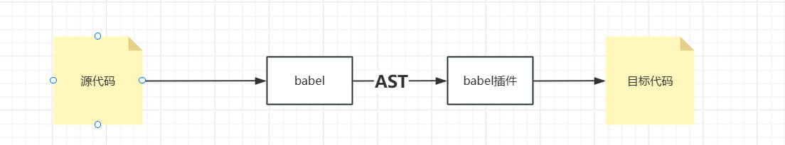
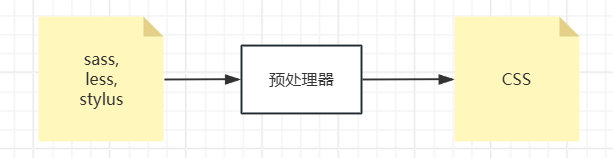
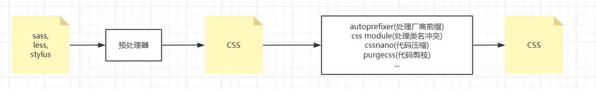
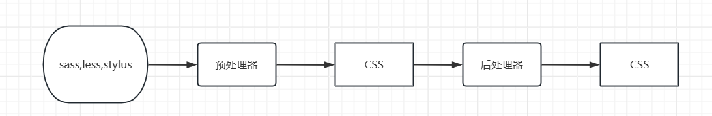
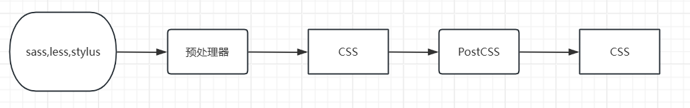
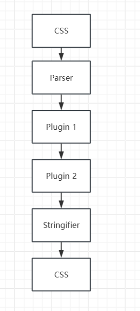

<script setup>
import StarTop from './StarTop.vue'
</script>
前面两个模块解决了工程化的基本问题，接下来解决`语言问题`

语言问题主要分为两方面
1. **兼容性**: 比如API兼容，语法兼容
2. **语言增强**：即原本语言根本就不支持，但是通过一些手段，让语言支持，比如html的增强,haml,jsp 等

前端就三门语言，`html`,`css`,`js`，而如今多以单页应用为主，很少直接书写`html`语言，都是通过js动态生成，所以`html`语言不是主要问题。

# js 工具链
## 兼容性
随着时间发展，es6,js的语法越来越丰富，但是浏览器兼容性是个问题，在一些老版本浏览器上并不支持新特性，所以需要通过一些手段，将新特性转换成老版本浏览器支持的特性。兼容性主要解决方案称之为`polyfill(填充物)`,即哪里有兼容性问题，就填充哪里，即使用无兼容性的代码实现相同或类似的功能。
::: danger 注意
`polyfill`不一定**百分百兼容**，比如像promise创建微队列，旧api根本无法实现一样的功能，因此会导致会有差异性
:::

### API兼容

在前端，api兼容的polyfill主要通过`core-js`实现
::: code-group
```txt [准备工作]
1.使用npm 初始化一个文件夹，安装core-js 依赖
2.使用node 10版本运行source.js 查看结果
3. 取消第一行或第二行注释，再次运行查看结果
```
```js [source.js]
// require('core-js') // 引入全部polyfill
// require('core-js/stable/array/flat-map') // 引入单个polyfill 会直接在Array.prototype上添加方法 flagMap方法
const result = [1, 2].flatMap((x) => [x, x * 2]);
console.log(result);
```
```txt [报错信息]
D:\code\my\npmInit\source.js:1
(function (exports, require, module, __filename, __dirname) { const result = [1, 2].flatMap((x) => [x, x * 2]);
                                                                                    ^
TypeError: [1,2].flatMap is not a function
    at Object.<anonymous> (D:\code\my\npmInit\source.js:1:85)
    at Module._compile (internal/modules/cjs/loader.js:678:30)
    at Object.Module._extensions..js (internal/modules/cjs/loader.js:689:10)
    at Module.load (internal/modules/cjs/loader.js:589:32)
    at tryModuleLoad (internal/modules/cjs/loader.js:528:12)
    at Function.Module._load (internal/modules/cjs/loader.js:520:3)
    at Function.Module.runMain (internal/modules/cjs/loader.js:719:10)
    at startup (internal/bootstrap/node.js:228:19)
    at bootstrapNodeJSCore (internal/bootstrap/node.js:575:3)
PS D:\code\my\npmInit>
```
```js [引入polyfill输出结果]
[ 1, 2, 2, 4 ]
```
:::
### 语法兼容

处理语法兼容，无法用polyfill来处理，因为新语法特性本身并不存在，所以需要通过一些手段，将新特性**转换**成老版本浏览器支持的特性。
这种处理方式 叫做 `syntax transform(语法转换)` 或者称之为`runtime（运行时）`,

像**箭头函数, async await ,可选访问符,生成器，解构等**新的语法特性，目前来看没有像api兼容那样有一个大而全的转换库，都是一个库通常只对一个语法特性进行转换；
比如处理**async await**的库`regenerator`
::: code-group
```txt [准备工作]
1.使用npm 初始化一个文件夹，安装regenerator 依赖
2.使用node 20版本运行compiler.js 查看生成的target.js
```
```js [source.js]
async function test() {
  return await Promise.resolve(1);
}

(async () => {
  const r = await test();
  console.log(r);
})();
```
```js [compiler.js]
const regenerator = require('regenerator');
const fs = require('fs');
const path = require('path');

const sourcePath = path.resolve(__dirname, './source.js');
const source = fs.readFileSync(sourcePath, 'utf-8');

const result = regenerator.compile(source, {
  includeRuntime: true,
});

const targetPath = path.resolve(__dirname, './target.js');
fs.writeFileSync(targetPath, result.code, 'utf-8');
console.log('compile success!');

```
转换之后的文件即可以在老版本浏览器上运行

## 语言增强

像js中语法增强常见的有`typeScript`,`jsx` 等，他们与js关系为包含关系，即js有的我有，js没有的我还有。因此才可以在增强的语言中随意书写js代码。
然后 `.ts`,或者`.jsx` 文件，浏览器无法识别，因此需要对应的转换工具，将.ts,或者.jsx 文件转换成浏览器可以识别的js文件。
下面以`typescript`为例，介绍下转换过程。

### babel js工具链大杀器

说白了兼容性和增强，都是通过将之前的代码转换成另一种代码。这么多需要转换的代码，需要不同的库来进行转换，就没有一个整合的工具么？

因此`bable`应运而生。

babel是一个工具链，它本身并不具备任何转换能力，它只是提供了一个转换的插件机制，通过插件机制，我们可以实现各种转换功能。



babel的转换过程分为三个阶段：

1. 解析（parse）

将代码字符串转换成抽象语法树（[AST](https://astexplorer.net/)）,即将代码字符串转换成树形结构，以便于进行分析。

2. 转换（transform）

对AST进行遍历，在此过程中对节点进行添加、更新、移除等操作。

3. 生成（generate）

根据变换后的AST再生成代码字符串，完成整个编译过程。

话不多说，举例如下：
::: code-group
```js [source.js]
const result = [1, 2].flatMap((x) => [x, x * 2]);
const a = {};

a?.b?.c?.d;
const f = ()=>{
    console.log("hello");
}
console.log(result);
```
```json [package.json ]
{
  "scripts": {
    "test": "echo \"Error: no test specified\" && exit 1",
    "babel": "babel source.js -o target.js"
  },
  "dependencies": {
    "core-js": "^3.37.1",
  },
  "devDependencies": {
    "@babel/cli": "^7.24.7",
    "@babel/core": "^7.24.7",
    "@babel/plugin-transform-arrow-functions": "^7.24.7",
    "@babel/plugin-transform-optional-chaining": "^7.24.7",
    "@babel/preset-env": "^7.24.7"
  }
}

```
```js [babel.config.js]
module.exports = {
    plugins:['@babel/plugin-transform-arrow-functions','@babel/plugin-transform-optional-chaining']
}
```
:::

其中 `@babel/plugin-transform-arrow-functions` 插件负责将箭头函数转换成普通函数，`@babel/plugin-transform-optional-chaining` 负责将可选链操作符转换成普通链操作符。

在终端运行 `npm run babel` 命令，生成 `target.js`,转换后的文件即可以在老版本浏览器上运行;
```js 
var _a$b;
const result = [1, 2].flatMap(function (x) {
  return [x, x * 2];
});
const a = {};
a === null || a === void 0 || (_a$b = a.b) === null || _a$b === void 0 || (_a$b = _a$b.c) === null || _a$b === void 0 || _a$b.d;
const f = function () {
  console.log("hello");
};
console.log(result);
```
一个插件解决一个特性，不也没有解决问题么？

使用`babel预设`,即Babel将那些常用的插件已经整合在一起了, 修改配置文件如下：
``` txt
module.exports = {
  presets: [
    [
      "@babel/preset-env",
      {
        targets: { // 兼容的浏览器版本
          edge: "17",
          firefox: "60",
          chrome: "67",
          safari: "11.1",
        },
        useBuiltIns: "usage",// 是否按需引入core-js
        corejs: "3.37.1", // 安装的core-js版本
      },
    ],
  ],
};

```
再次运行 `npm run babel` 命令，生成 `target.js`,转换后的文件如下;
```js
"use strict";

require("core-js/modules/es.array.flat-map.js");
require("core-js/modules/es.array.unscopables.flat-map.js");
var _a$b;
const result = [1, 2].flatMap(x => [x, x * 2]);
const a = {};
a === null || a === void 0 || (_a$b = a.b) === null || _a$b === void 0 || (_a$b = _a$b.c) === null || _a$b === void 0 || _a$b.d;
const f = () => {
  console.log("hello");
};
console.log(result);
```
babel 预设 安装了很多插件，具体可以查看[babel-preset-env](https://babeljs.io/docs/en/babel-preset-env)文档。

# css工具链
## css语言主要存以下问题
::: info 
1. 语法缺失，比如：循环，条件判断，虽然css有@keyframes,@media,@supports等语法，但是这远远不够。
2. 功能缺失，比如：颜色函数，数学函数，工具函数
3. 兼容性问题
4. 类名冲突
:::

由于以上原因导致css处理复杂项目变得非常困难。既然css 没有这些功能，那么就创造一门新语言。比如`sass`,`less`,`stylus`。

但是，浏览器并不认识，因此需要将其`转换`。
## sass案例
下面以sass为例，生成星空顶
::: code-group
```scss [index.scss]
.sass-demo {
  background: radial-gradient(ellipse at bottom, #1b2735 0%, #090a0f 100%);
  overflow: hidden;
  height: 100vh;
  width: 100vw;
  position: fixed;
  z-index: 222;
  top: 0;
}
.sass-demo-title {
  position: absolute;
  top: 50%;
  left: 0;
  right: 0;
  color: #fff;
  text-align: center;
  font-family: "lato", sans-serif;
  font-weight: 300;
  font-size: 50px;
  letter-spacing: 10px;
  margin-top: -60px;
  padding-left: 10px;
  background: linear-gradient(white, #416b94);
  background-clip: text;
  -webkit-background-clip: text;
  color: transparent;
}

@function createShadow($n) {
  $shadow: "#{random(100)}vw #{random(100)}vh #fff";
  @for $i from 2 through $n {
    $shadow: "#{$shadow}, #{random(100)}vw #{random(100)}vh #fff";
  }
  @return unquote($shadow);
}
$count: 1000;
$duration: 400s;
@for $i from 1 through 5 {
  $count: floor(calc($count / 2));
  $duration: floor(calc($duration / 2));
  .sass-demo-layer#{$i} {
    $size: #{$i}px;
    position: fixed;
    width: $size;
    height: $size;
    border-radius: 50%;
    left: 0;
    top: 0;
    box-shadow: createShadow($count);
    animation: moveUp $duration linear infinite;
    &::after {
      content: "";
      position: fixed;
      left: 0;
      top: 100vh;
      width: inherit;
      height: inherit;
      border-radius: inherit;
      box-shadow: inherit;
    }
  }
}

@keyframes moveUp {
  100% {
    transform: translateY(-100vh);
  }
}
```
```html [index.html]
<!DOCTYPE html>
<html lang="en">
  <head>
    <meta charset="UTF-8" />
    <meta name="viewport" content="width=device-width, initial-scale=1.0" />
    <title>Document</title>
    <link rel="stylesheet" href="./index.css" />
  </head>
  <body>
    <div class="sass-demo" @click="visible = false" v-show="visible">
      <div class="sass-demo-layer1"></div>
      <div class="sass-demo-layer2"></div>
      <div class="sass-demo-layer3"></div>
      <div class="sass-demo-layer4"></div>
      <div class="sass-demo-layer5"></div>
      <div class="sass-demo-title">Sass星空顶</div>
    </div>
  </body>
</html>
```
```json [package.json]
{
  "name": "myblob",
  "version": "1.0.0",
  "description": "",
  "main": "index.js",
  "scripts": {
    "test": "sass index.scss index.css",
  },
  "devDependencies": {
    "sass": "^1.77.4",
  }
}
```
运行命令，发现生成的css代码高达百行

<StarTop></StarTop>

目前的流程如下：

## 后处理器
虽然生成的css代码能运行，但是还有一些问题需要处理，比如说**厂商前缀，类名冲突，代码剪枝**等等一系列问题，因此我们需要一些工具再次将生成的css代码进行转换。

而以上等等一系列再次转换的工具我们称之为**后处理器**。



既然都是转换，那么有没有一个工具将这些后处理器集成起来？
## postcss

答案是肯定的，这就是**[PostCSS](https://www.postcss.com.cn/docs/)**。



PostCss 工作流程如下：给我一个css经过一系列转换生成新的css，因此`PostCss`常被称为**后处理器**，虽然没错，但是`PostCss`的功能不止于此。

它允许自定以`Parser(解析器)`,因此他其实可以将预处理也融合到`PostCss`中。



`PostCss` 其实就是相当于`js`中的 `babel`,他也有自己的 **[插件生态](https://postcss.org/docs/postcss-plugins)**,以及**预设**;

::: code-group
```css [index.css]
.container::placeholder {
color:#f40;
}
```
```json [package.json]
{
  "name": "npminit",
  "version": "1.0.0",
  "description": "",
  "main": "index.js",
  "scripts": {
    "complie": "postcss index.css -d dist -w --no-map"
  },
  "keywords": [],
  "author": "",
  "license": "ISC",
  "dependencies": {
    "cssnano": "^7.0.2",
    "postcss": "^8.4.38",
    "postcss-cli": "^11.0.0",
    "postcss-modules": "^6.0.0",
    "postcss-preset-env": "^9.5.14",
  },
}

```
```js [postcss.config.js（配置文件）]
module.exports = {
  map: false,
  plugins: [
    "postcss-preset-env",
    "postcss-modules",
    require("cssnano")({
      preset: "default",
    }),
  ],
};

```
::: 

运行`npm run complie` 生成的css文件如下：
```css
._container_1mvc9_1::-moz-placeholder{color:#f40}._container_1mvc9_1::placeholder{color:#f40}
```