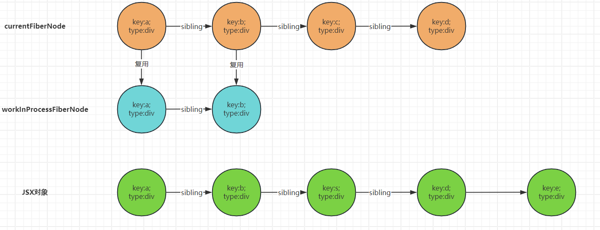
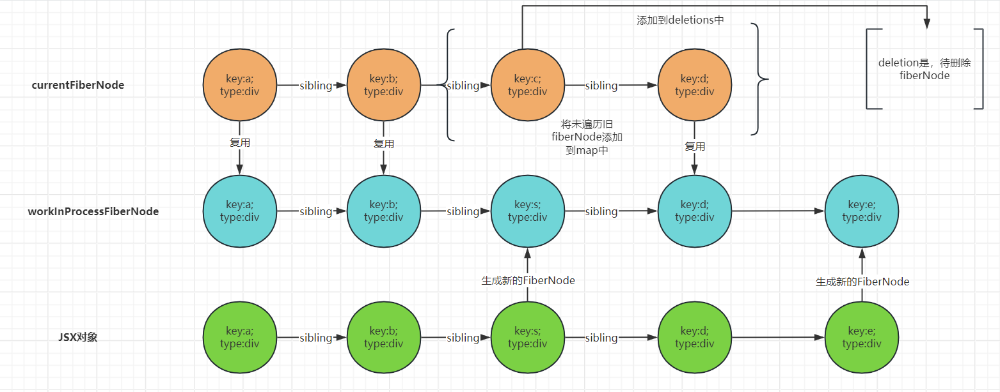

> 基于React18.2.0 编写

自从React16.8之后，函数组件引来了重大更新，其中最显著的变化就是引入了新的Hooks API。这些Hooks API使得在函数组件中使用状态、副作用和上下文变得更加简单和高效。自此函数组件的时代到来。

为什么要使用React Hooks？

1. 状态逻辑复用：Hooks使你在无需修改组件结构的情况下复用状态逻辑。这使得在组件之间或者不同场景之间复用复杂逻辑变得容易。
2. 无需关注类组件中this指向问题，以及繁琐的生命周期。
3. 可读性：React Hooks将组件分为渲染函数、副作用和逻辑函数，这使得代码的规则更简单，易于理解和维护。

限制：

1. 不能在循环、条件或嵌套函数中调用Hooks，因为React需要按照代码的顺序执行Hooks。
2. 只能在函数组件中调用Hooks，不能在类组件或函数组件之外的地方调用。

# hooksApi介绍
## useState 状态

useState是React Hooks中最常用的一个Hook，它用于在函数组件中创建和更新状态。useState接收一个初始状态值作为参数，并返回一个状态变量和一个更新状态的函数。

语法如下：
```js
const [state, setState] = useState(initialState);
```
当调用setState函数时，React会重新调用该函数组件，并将新的状态值赋给状态变量state。是否决定重新调用该函数组件取决于状态变量state是否发生了变化。这一点跟类组件中的setState函数是类似的。
```js
import { useState } from "react";
export default function MyComponent() {
    const [count, setCount] = useState(0);
    const [obj, setObj] = useState({ a: 1, b: 2 });

    const handleClick = () => {
        obj.a = 10;
        setObj(obj)
    }
    console.log('渲染了')
    return (
        <div>
            count: {count}
            obj: {JSON.stringify(obj)}
            <button onClick={() => setCount(0)}>传入相同值</button>
            <button onClick={() => setCount(count + 1)}>change</button>
            <button onClick={handleClick}>改变obj</button>
        </div>
    )
}
```
当点击第一个按钮时，和第三个按钮不会进行重新渲染，只有点击第二个才会；

## useEffect 副作用
useEffect是React Hooks中最常用的另一个Hook，它用于在函数组件中执行副作用操作。该函数接受两个参数
 1. 第一个参数是一个副作用函数，用于定义副作用操作，可以返回一个清理函数。副作用函数会在`组件渲染后执行`，这意味着可以在该函数执行时拿到`真实dom元素`，并且可以修改组件的state。返回的`清理函数`会在`组件卸载前执行以及下一次状态更新之前执行`，意味着在清理函数中获取的状态是之前的状态。
 2. 第二个参数是一个可选的`依赖项`数组。
    * 当没有依赖项时，副作用函数会在每次渲染后执行。
    * 当依赖项为空时，副作用函数只会在组件挂载后执行一次。
    * 当存在依赖项时，副作用函数会在组件挂载及依赖项发生变化后执行。内部使用Object.is的浅比较来比较依赖项的变化。

看如下例子：
```js
import { useState, useEffect } from "react";
export default function MyComponent() {
    const [count, setCount] = useState(0);
    useEffect(() => {
        console.log('无依赖选项的副作用函数');
        return () => {
            console.log('无依赖选项的清理函数')
        }
    })
    useEffect(() => {
        console.log('依赖选项为空数组的副作用函数');
        return () => {
            console.log('依赖选项为空数组的清理函数')
        }
    },[])
    useEffect(() => {
        console.log('依赖状态的副作用函数',count);
        return () => {
            console.log('依赖状态的清理函数',count)
        }
    },[count])
    console.log('渲染了')
    return (
        <div>
            <p>count: {count}</p>
            <button onClick={() => setCount(count + 1)}>change</button>
        </div>
    )
}

```
```
控制台打印如下： 
渲染了
无依赖选项的副作用函数
依赖选项为空数组的副作用函数
依赖状态的副作用函数 0

点击按钮之后，打印如下：
渲染了
无依赖选项的清理函数
依赖状态的清理函数 0
无依赖选项的副作用函数
依赖状态的副作用函数 1
```

## useContext 上下文

::: tip 应用场景
组件共享数据
:::

React.createContext 方法创建一个Context对象,该对象包含两个属性`Provider,Consumer` 皆为react元素，**类似于Vue中provide 和 inject 函数**。当 React 渲染一个订阅了这个 Context 对象的组件，这个组件会从组件树中离自身最近的那个匹配的 Provider 中读取它的值。

useContext 接收一个 context 对象（React.createContext 的返回值）并返回该 context 的当前值。当前的 context值由上层组件中距离当前组件最近的 <MyContext.Provider> 的 value prop 决定。

当组件`上层最近的` <MyContext.Provider> 更新时，该 Hook 会触发重渲染，并使用最新传递给 MyContext 的 context 值。**即使祖先使用 React.memo 或 shouldComponentUpdate，也会在组件本身使用 useContext 时重新渲染。**
如果组件中多次使用同一个 Context，则仅会在组件渲染时调用一次 useContext。

如果 React 没有在父树中找到该特定 context 的任何 provider，useContext() 返回的 context 值将等于你在 创建 context 时指定的 默认值：
```js
import { createContext, useContext } from 'react';

const ThemeContext = createContext(null);

export default function MyApp() {
  return (
    <ThemeContext.Provider value="dark">
      <Form />
    </ThemeContext.Provider>
  )
}

function Form() {
  return (
    <Panel title="Welcome">
      <Button>Sign up</Button>
      <Button>Log in</Button>
      <ThemeContext.Provider value="light">
        <Footer />
      </ThemeContext.Provider>
    </Panel>
  );
}

function Footer() {
  return (
    <footer>
      <Button>Settings</Button>
    </footer>
  );
}

function Panel({ title, children }) {
  const theme = useContext(ThemeContext);
  const className = 'panel-' + theme;
  return (
    <section className={className}>
      {title && <h1>{title}</h1>}
      {children}
    </section>
  )
}

function Button({ children }) {
  const theme = useContext(ThemeContext);
  const className = 'button-' + theme;
  return (
    <button className={className}>
      {children}
    </button>
  );
}
```


## useRef

useRef 返回一个可变的 ref 对象，其 .current 属性被初始化为传入的参数（initialValue）。返回的 ref 对象在组件的整个生命周期内保持不变。当改变ref.current的值时，不会触发组件的重新渲染。
::: tip 应用场景
1. 保存一个可变值
2. 保存一个 DOM 节点（直接作用于原生html标签时，可以获取到该标签的dom元素）
3. 保存一个组件实例(类组件)
:::
```js
export default function MyCount(){
    const [count,setCount] = useStete(0);
    const timer = useRef(null);

    const asyncAdd = ()=>{
        if(timer.current){
            clearTimeout(timer.current);
        }
        timer.current = setTimeout(()=>{
            setCount(count+1);
        }
        ,1000);
    }
    return (
        <div>
            <P>{count}</P>
            <button onClick={asyncAdd}>一直加</button>
        </div>
    )
}
```
当多次点击按钮时，会按照预期结果增加计数，一秒加一次；
如果 将 const timer = useRef(null); 改为 let timer = null;
将会导致if判断进不去，从而页面有多个计时器存在。

::: danger 注意
1. 除了 初始化 外不要在渲染期间写入或者读取 ref.current，否则会使组件行为变得不可预测。应该在副作用或者事件函数中写入或读取。
2. 不可以将ref赋值给函数组件，除非使用forwardRef高阶函数进行包裹（**注意：React19版本已废弃forwordRef，可以直接将ref赋值给函数组件，函数组件将从属性中拿到ref**）
:::

## useImperativeHandle(ref,createHandle,deps)

useImperativeHandle 允许自定义暴露给父组件的实例值。在大多数情况下，应当避免使用 ref 这样的命令式代码。useImperativeHandle 应当与 forwardRef 一起使用。 于Vue中的`defineExpose`类似
该函数接受三个参数：
1. 第一个参数： 该 ref 是你从 forwardRef 渲染函数 中获得的第二个参数。
2. 第二个参数： 你可以返回一个对象来设置需要暴露给父组件的值。
3. 第三个参数： 依赖项数组。当依赖发生变化时，createHandle 函数会被调用。

```js
import React, { useRef, useImperativeHandle } from 'react';
const MyInput =  React.forwardRef( function MyCount(props,ref){
    const inputRef = useRef(null);
    const myFunc = ()=>{
        console.log('myFunc');
    }
    useImperativeHandle(ref,()=>{
        return {
            myFunc,
            foucs:()=>{
                inputRef.current.focus();
            }
        }   
    },[])
    return (<input ref={inputRef}><input/>);
});
export function Parent(){
    const inputRef = useRef(null);
    return (
        <div>
            <MyCount ref={inputRef}></MyCount>
            <button onClick={()=>{
                inputRef.current.myFunc();
                inputRef.current.foucs();
            }}>点击</button>
        </div>)
}

```
## useMemo 缓存结果-性能优化
它在每次重新渲染的时候能够缓存计算的结果，当依赖项目发生改变时，才会重新计算。类似与Vue 中 `computed`；
该hooks 会`调用`计算函数，并将其结果缓存起来。该函数调用时机在 `状态更新之后，浏览器绘制之前`。
useMemo 接受两个参数：
1. 第一个参数： 计算函数
2. 第二个参数： 依赖项数组。当依赖发生变化时，重新掉用计算函数

```js
const cachedValue = useMemo(calculateValue, dependencies);
```

## useCallback 缓存函数-性能优化
缓存函数的引用，避免在每次渲染的时候都重新创建函数。该hook不会调用缓存的函数,经常搭配memo函数(与PureComponent一致)使用。
useCallback 接受两个参数：
1. 第一个参数： 需要缓存的函数
2. 第二个参数： 依赖项数。 当依赖选项发现变化时，重新创建函数；

> 当切换主题时， Rendering <ShippingForm /> 不会输出。
::: code-group
```js [App.js]

import { useState } from 'react';
import ProductPage from './ProductPage.js';

export default function App() {
  const [isDark, setIsDark] = useState(false);
  return (
    <>
      <label>
        <input
          type="checkbox"
          checked={isDark}
          onChange={e => setIsDark(e.target.checked)}
        />
        Dark mode
      </label>
      <hr />
      <ProductPage
        referrerId="wizard_of_oz"
        productId={123}
        theme={isDark ? 'dark' : 'light'}
      />
    </>
  );
}
```
```js [ProductPage.js]
import { useCallback } from 'react';
import ShippingForm from './ShippingForm.js';

export default function ProductPage({ productId, referrer, theme }) {
  const handleSubmit = useCallback((orderDetails) => {
    post('/product/' + productId + '/buy', {
      referrer,
      orderDetails,
    });
  }, [productId, referrer]);

  return (
    <div className={theme}>
      <ShippingForm onSubmit={handleSubmit} />
    </div>
  );
}

function post(url, data) {
  // 想象这发送了一个请求
  console.log('POST /' + url);
  console.log(data);
}
```
``` js [ShippingForm.js]
import { memo, useState } from 'react';

const ShippingForm = memo(function ShippingForm({ onSubmit }) {
  const [count, setCount] = useState(1);

  console.log('[ARTIFICIALLY SLOW] Rendering <ShippingForm />');
  let startTime = performance.now();
  while (performance.now() - startTime < 500) {
    // 500 毫秒内不执行任何操作来模拟极慢的代码
  }

  function handleSubmit(e) {
    e.preventDefault();
    const formData = new FormData(e.target);
    const orderDetails = {
      ...Object.fromEntries(formData),
      count
    };
    onSubmit(orderDetails);
  }

  return (
    <form onSubmit={handleSubmit}>
      <p><b>Note: <code>ShippingForm</code> is artificially slowed down!</b></p>
      <label>
        Number of items:
        <button type="button" onClick={() => setCount(count - 1)}>–</button>
        {count}
        <button type="button" onClick={() => setCount(count + 1)}>+</button>
      </label>
      <label>
        Street:
        <input name="street" />
      </label>
      <label>
        City:
        <input name="city" />
      </label>
      <label>
        Postal code:
        <input name="zipCode" />
      </label>
      <button type="submit">Submit</button>
    </form>
  );
});

export default ShippingForm;
```
:::

## useLayoutEffect

`useLayoutEffect` 类似于 `useEffect`，但在 DOM 更新之后同步调用 effect。可以使用它来读取 DOM 布局并同步触发重渲染。在浏览器执行绘制之前，useLayoutEffect 内部的更新计划将被同步刷新，即该hook会阻塞浏览器绘制。

该函数参数与`useEffect`一致。
例子：[tooltip布局](https://react.docschina.org/reference/react/useLayoutEffect#measuring-layout-before-the-browser-repaints-the-screen)

## 虚拟 DOM
虚拟 DOM 最早是由 React 团队提出来的，因此 React 团队在对虚拟 DOM 的定义上面有绝对的话语权。
> [react对虚拟dom的介绍](https://legacy.reactjs.org/docs/faq-internals.html)

**Virtual DOM 是一种编程概念。**在这个概念里， UI 以一种理想化的，或者说“虚拟的”表现形式被保存于内存中。

也就是说，只要我们有一种方式，能够将真实 DOM 的层次结构描述出来，那么这就是一个虚拟 DOM。


在 React 中，React 团队使用的是 JS 对象来对 DOM 结构进行一个描述。但是很多人会直接把 JS 对象和虚拟 DOM 划等号，这种理解是不太准确的，比较片面的。

虚拟 DOM 和 JS 对象之间的关系：**前者是一种思想，后者是一种思想的具体实现。**

::: tip 优势
- 相较于 DOM 的体积优势和速度优势
- 多平台的渲染抽象能力
:::

**相较于dom体积的优势和速度优势**
首先我们需要明确一个点，JS 层面的计算速度要比 DOM 层面的计算要快：

- DOM 对象最终要被浏览器渲染出来之前，浏览器会有很多工作要做（浏览器的渲染原理）
- DOM 对象上面的属性也非常非常多

在初次渲染中，虚拟dom甚至比真实DOM要慢，而他的优势主要体现在后续的更新中。

**多平台的渲染抽象能力**

UI = f（state）这个公式进一步进行拆分可以拆分成两步：

- 根据自变量的变化计算出 UI
- 根据 UI 变化执行具体的宿主环境的 API

虚拟 DOM 只是多真实 UI 的一个描述，回头根据不同的宿主环境，可以执行不同的渲染代码：

- 浏览器、Node.js 宿主环境使用 ReactDOM 包
- Native 宿主环境使用 ReactNative 包
- Canvas、SVG 或者 VML（IE8）宿主环境使用 ReactArt 包
- ReactTest 包用于渲染出 JS 对象，可以很方便地测试“不隶属于任何宿主环境的通用功能”

## Diff 算法
diff 算法本身是有性能上面的消耗，在 React 文档中有提到，即便采用最前沿的算法，如果要完整的对比两棵树，那么算法的复杂度都会达到 O(n^3)，n 代表的是元素的数量，如果 n 为 1000，要执行的计算量会达到十亿量级的级别。

因此，为了降低算法的复杂度，React 为 diff 算法设置了 3 个限制：
1. 只对**同级别元素进行** diff，如果一个 DOM 元素在前后两次更新中跨越了层级，那么 React 不会尝试复用它
2. 两个**不同类型的元素会产生不同的树**。比如元素从 div 变成了 p，那么 React 会直接销毁 div 以及子孙元素，新建 p 以及 p 对应的子孙元素
3. 开发者可以通过 key 来暗示哪些子元素能够保持稳定

diff 计算发生在更新阶段，当第一次渲染完成后，就会产生 Fiber 树，再次渲染的时候（更新），就会拿新的 JSX 对象（vdom）和旧的 FiberNode 节点进行一个对比，再决定如何来产生新的 FiberNode，它的目标是尽可能的复用已有的 Fiber 节点。这个就是 diff 算法。
### 单节点Diff
所谓单节点是指**新的节点为单一节点**，但是旧节点的数量是不一定的。
1. 判断 key 是否相同
  - 如果更新前后均未设置 key，则 key 均为 null，也属于相同的情况
  - 如果 key 相同，进入步骤二
  - 如果 key 不同，则无需判断 type，结果为不能复用（有兄弟节点还会去遍历兄弟节点）
2. 如果 key 相同，再判断 type 是否相同
  - 如果 type 相同，那么就复用，将兄弟节点标记为删除
  - 如果 type 不同，则无法复用（并且兄弟节点也一并标记为删除）
### 多节点Diff
多节点 diff 会分为两轮遍历
1. 第一轮遍历会从前往后进行遍历，存在以下三种情况：
  - 如果新旧子节点的key 和 type 都相同，说明可以复用
  - 如果新旧子节点的 key 相同，但是 type 不相同，这个时候就会根据 ReactElement 来生成一个全新的 fiber，旧的 fiber 被放入到 deletions 数组里面，回头统一删除。但是注意，此时遍历并不会终止。
  - 如果新旧子节点的 key不同 或 type和key 都不相同，结束遍历
2. 第二轮遍历会遇到三种情况：
  - 只剩下旧子节点：将旧的子节点添加到 deletions 数组里面直接删除掉（删除的情况）
  - 只剩下新的 JSX 元素：根据 ReactElement 元素来创建 FiberNode 节点（新增的情况）
  - 新旧子节点都有剩余：会将剩余的 FiberNode 节点放入一个 map 里面，遍历剩余的新的 JSX 元素，然后从 map 中去寻找能够复用的 FiberNode 节点，如果能够找到，就拿来复用，最后将map中剩余未复用的旧FiberNode 添加到deletions中。（移动的情况）

::: info 为什么React没有使用双端diff算法
由于双端 diff 需要向前查找节点，**但每个 FiberNode 节点上都没有反向指针**，即前一个 FiberNode 通过 sibling 属性指向后一个 FiberNode，只能从前往后遍历，而不能反过来，因此该算法无法通过双端搜索来进行优化。

React 想看下现在用这种方式能走多远，如果这种方式不理想，以后再考虑实现双端 diff。React 认为对于列表反转和需要进行双端搜索的场景是少见的，所以在这一版的实现中，先不对 badcase 做额外的优化。
:::

**单节点更新举例**
```html
<!-- 更新前-->
<div>
  <p>A</p>
  <p key='B'>B</p>
  <p>C</p>
</div>

<!--更新后-->
<div>
  <div key="B">B</p>
</div>
```
步骤如下：
1. 与 `<p>A</p>` 进行比较key值，key值不同，添加到删除队列中，继续遍历兄弟节点
2. 与 `<p key='B'>B</p>` 进行比较key值，key相同
3. 判断type，前者为 p，后者为div，不同不能复用，将该节点及其兄弟节点添加到删除队列中，结束遍历；

**多节点diff举例**
更新前

```html
<!--更新前-->
<div>
	<div key="a">a</div>
  <div key="b">b</div>
  <div key="c">c</div>
  <div key="d">d</div>
</div>

<!--更新后-->
<div>
	<div key="a">a</div>
  <div key="b">b</div>
  <div key="s">c</p>
  <div key="d">d</div>
  <div key="e">d</div>
</div>
```
**第一次遍历：**
1. 前面两个节点无改动，复用旧FiberNode
2. 第三个节点，key值不同，推出第一次循环；



**第二次遍历**
1. 将未遍历完的旧FiberNode放入map中，遍历新节点
2. 如果可以找到map中能复用的节点，则复用；反之，根据JSX对象生成新的FiberNode；
3. 将未复用的旧FiberNode节点，添加到deletions中，以备删除



## React Fiber架构

[React Fiber 介绍](https://github.com/acdlite/react-fiber-architecture?tab=readme-ov-file)
> 什么是Fiber？
> Fiber is the new reconciliation engine in React 16. Its main goal is to enable incremental rendering of the virtual DOM

React Fiber架构是React 16引入的新的架构，它能够将渲染工作分割成块，并且让渲染过程可以被中断，将控制权交回浏览器，让浏览器可以进行其他高优先级的任务，等浏览器空闲了，再继续渲染。 主要目的就是为了提高虚拟DOM 的增量渲染性能。

### 为什么需要Fiber架构

- 由于React 15架构是同步的，如果组件树很复杂，那么渲染任务需要大量时间，就会导致浏览器长时间失去响应，用户就会感觉到卡顿。


